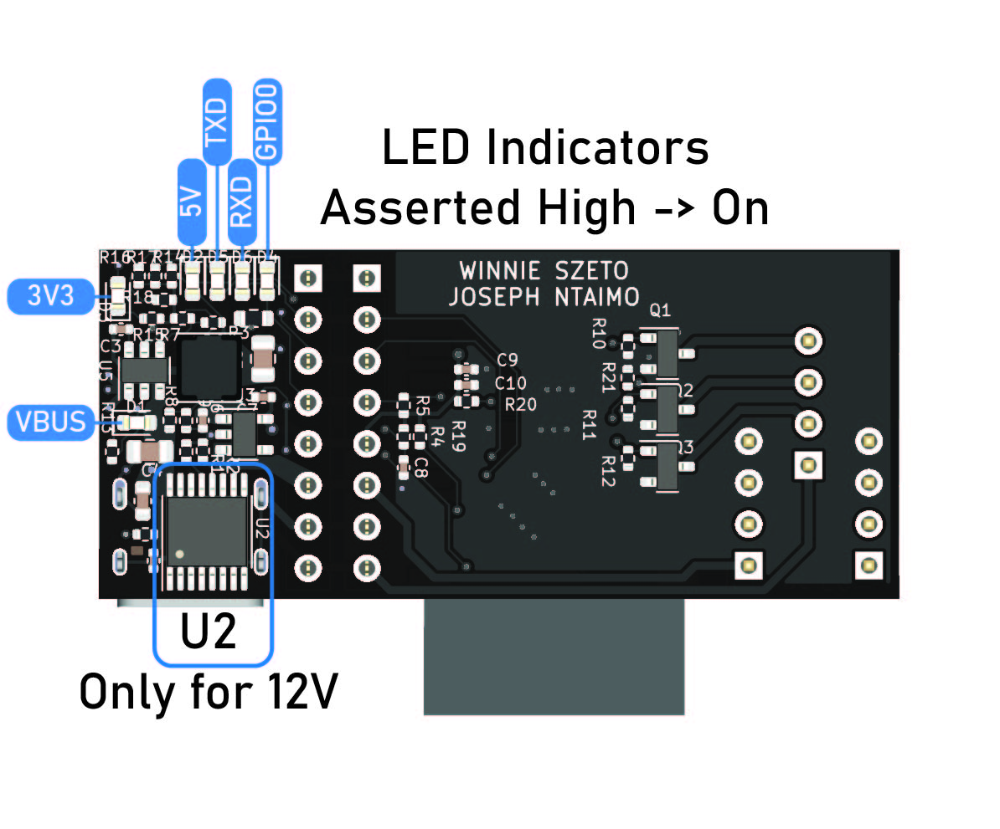
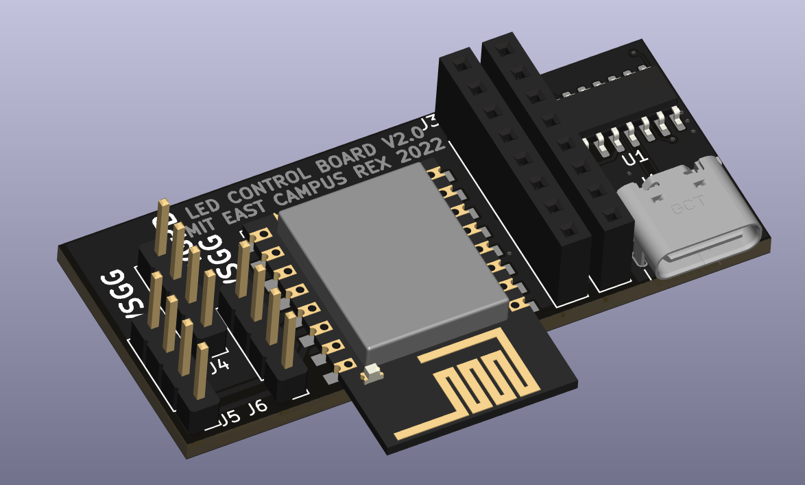

# LED-Control-Board-V2
Version 3 of a easy-to-deploy, low-cost PCBA to control LED lights over Wi-Fi. Designed for use at MIT's East Campus REX event to light up large forts and structures at distances of over 28 ft.

[Interactive BOM](https://htmlpreview.github.io/?https://raw.githubusercontent.com/wszeto9/LED-Control-Board-V2/main/breakout_boards/ibom.html)

**Features:**

- All surface-mount components are basic components that can be placed with JLCPCB's SMT service
- All components that require hand-soldering are through-hole

- Power is transmitted through 14' long ethernet cables to simplify wiring

- Power Input is fused with Mini Blade Fuses

Pinout

LED Indicators

Populated Board
